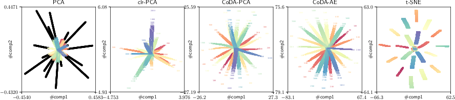

# Representational Learning of Compositional Data

This is the source code, data, and supplementary materials for:

M. Avalos-Fernandez, R. Nock, C.S. Ong, J. Rouar, K. Sun,
*Representational Learning of Compositional Data*,
Advances in Neural Information Processing Systems 31, 2018.

[download PDF](https://bitbucket.org/RichardNock/coda/downloads/avalos-fernandez18coda-pca.pdf)



[](https://www.youtube.com/watch?v=TqLqGwtInSA)

---

### Software

We have software in **Python** and **R** in the repository for performing the experiments.

---

### Data

The simulated dataset is constructed by the function ```arms()``` in ```runpca.py```.

Microbiome data:

- **Atlas** [data](https://bitbucket.org/RichardNock/coda/downloads/atlas2.csv) and [headers](https://bitbucket.org/RichardNock/coda/downloads/atlasfactors2.csv)
- **Diet Swap** [data](https://bitbucket.org/RichardNock/coda/downloads/dietswap.csv) and [headers](https://bitbucket.org/RichardNock/coda/downloads/dietfactors.csv)

---

###  Implementations

We implemented the following methods

- **nonparametric CoDA-PCA** optimized by scipy's L-BFGS; requires less tunning
- **parametric CoDA-PCA** optimized by Adam; requires tunning based on input data; learns a parametric mapping from X to A
- **CoDA-Autoencoder** is similar to parametric CoDA-PCA except the latent space is nonlinear
- **clr-PCA** applies PCA on the clr transformation
- **clr-AE** is an autoencoder based on clr transformation

---

### Run the Python codes

First install all dependencies.
```
$ pip install -r requirements.txt
```

In order the run the benchmark experiments, run
```
$ ./runpca.py data.csv
```
which will generate a ```npz``` file containing the benchmarking results. Notice that you may need to

- adapt the data loading method in ```runpca.py``` based on the format of your csv files
- adjust the hyperparameters (size of hidden layer etc.)

Look into ```run.sh``` for examples of running our codes.

---

### Analyzing the results

We provide ```numpy``` files containing our experimental results on the [atlas2](https://bitbucket.org/RichardNock/coda/downloads/atlas2.csv_lrate0.005_batchsize32_epochs300_maxdim10_test0.1.npz) and [dietswap](https://bitbucket.org/RichardNock/coda/downloads/dietswap.csv_lrate0.005_batchsize32_epochs500_maxdim10_test0.1.npz) datasets.

To generate the figures, run
```
$ ./fig_benchmark_curves.py file1.npz [file2.npz]
```
after replacing file1 and file2 with the npz filenames generated by ```runpca.py```.

To plot the 20arms example, run
```
$ ./runpca.py --visualize 20arms
```
which will produce a pdf figure of the dimensionality reduction results. In order to have
quantative assessment on the visualization, one should perform the benchmarking by
running ```runpca.py``` without the ```--visualize``` argument.

---

### Bibtex
```
@Incollection{avalos18codapca,
  author = {Marta Avalos-Fernandez and Richard Nock and Cheng Soon Ong and Julien Rouar and Ke Sun},
  title  = {Representational Learning of Compositional Data},
  booktitle = {Advances in Neural Information Processing Systems 31},
  pages = {6678--6688},
  publisher = {Curran Associates, Inc.},
  year   = {2018},
}
```
